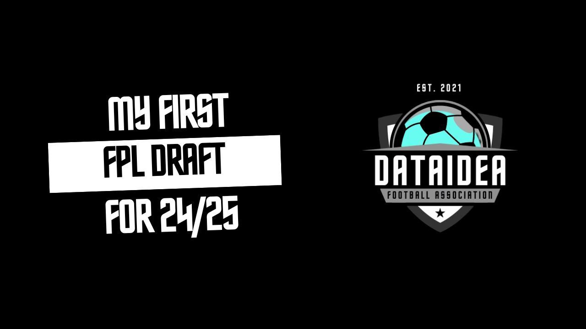
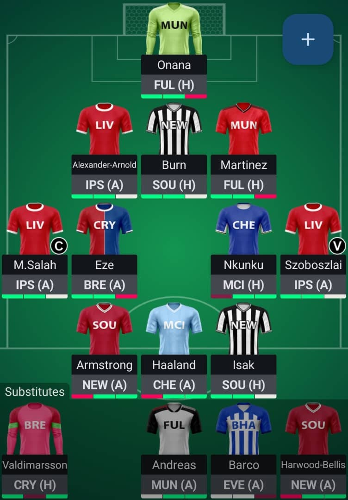

As the new Premier League season kicks off, it's time to reveal my Fantasy Premier League (FPL) squad for the 2024/25 campaign. This season, I've aimed for a balanced squad with a mix of proven performers and potential breakout stars. Here's a breakdown of my team selection and the rationale behind each pick.

## Goalkeeper

**André Onana (MUN)**

- Fixture: Fulham (H)
- Onana ended last season in excellent form, providing Manchester United with a solid foundation at the back. His shot-stopping ability and distribution skills make him a valuable asset.

<!-- Newsletter -->

<h4><i class="bi bi-info-circle-fill"></i> Don't Miss Any Updates!</h4>

Before we continue, I have a humble request, to be among the first to hear about future updates of the course materials, simply enter your email below, follow us on <a href="https://x.com/dataideaorg"><i class="bi bi-twitter-x"></i>
(formally Twitter)</a>, or subscribe to our <a href="https://www.youtube.com/@dataideaorg"><i class="bi bi-youtube"></i> YouTube channel</a>.

<iframe class="newsletter-frame" src="https://embeds.beehiiv.com/5fc7c425-9c7e-4e08-a514-ad6c22beee74?slim=true" data-test-id="beehiiv-embed" height="52" frameborder="0" scrolling="no">
</iframe>

## Defenders

**Trent Alexander-Arnold (LIV)**

- Fixture: Ipswich (A)
- Known for his attacking prowess and set-piece delivery, Alexander-Arnold is a must-have. He consistently provides assists and occasionally scores, making him a high-value defender.

**Dan Burn (NEW)**

- Fixture: Southampton (H)
- Burn's physical presence and aerial ability make him a threat on both ends of the pitch. With a favorable home fixture against Southampton to kick off the season, he has the potential for clean sheets and goal contributions.

**Lisandro Martínez (MUN)**

- Fixture: Fulham (H)
- Martínez is back at the heart of Man United for the new season. Man United is having a few good starting fixtures and I could use a very cheap under priced Martinez to break into their defense.

<!-- inline-square -->

<ins class="adsbygoogle"
     style="display:block"
     data-ad-client="ca-pub-8076040302380238"
     data-ad-slot="3564352555"
     data-ad-format="auto"
     data-full-width-responsive="true"></ins>

## Midfielders

**Mohamed Salah (LIV) - Captain**

- Fixture: Ipswich (A)
- Salah's track record speaks for itself. As Liverpool's main attacking threat, he's a consistent point scorer, and his captaincy choice reflects my confidence in his ability to deliver.

**Eberechi Eze (CRY)**

- Fixture: Brentford (A)
- Eze's creativity and goal-scoring ability make him a key player for Crystal Palace. He's involved in most of their attacking plays and can earn valuable points.

**Christopher Nkunku (CHE)**

- Fixture: Manchester City (H)
- Despite a challenging fixture, Nkunku's talent and attacking mindset make him a worthy inclusion. His ability to score and assist against top teams could provide a differential advantage- hopefully he stays fit.

**Dominik Szoboszlai (LIV) - Vice-Captain**

- Fixture: Ipswich (A)
- Szoboszlai has been on fire this pre season and it appears Slot is unlocking a beast out of him this season. With a favorable fixture, he could rack up significant points and support Salah in the attack.

<!-- inline-square -->

<ins class="adsbygoogle"
     style="display:block"
     data-ad-client="ca-pub-8076040302380238"
     data-ad-slot="3564352555"
     data-ad-format="auto"
     data-full-width-responsive="true"></ins>

## Forwards

**Adam Armstrong (SOU)**

- Fixture: Newcastle (A)
- I will admit I got this guy out of lack of budget, but Armstrong's pace and finishing skills make him a good threat and worthy to gamble on.

**Erling Haaland (MCI)**

- Fixture: Chelsea (A)
- Haaland's goal-scoring exploits need no introduction. Even against strong opposition, he's likely to find the back of the net, making him a crucial part of my team.

**Alexander Isak (NEW)**

- Fixture: Southampton (H)
- Isak had a 0.95 xG last season, his versatility and goal-scoring ability make him a valuable asset. With a favorable home fixture, he's poised to deliver significant points.

<!-- inline-square -->

<ins class="adsbygoogle"
     style="display:block"
     data-ad-client="ca-pub-8076040302380238"
     data-ad-slot="3564352555"
     data-ad-format="auto"
     data-full-width-responsive="true"></ins>

## Substitutes

1. **Patrik Valdimarsson (BRE)**
   - Fixture: Crystal Palace (H)
2. **Andreas Pereira (FUL)**
   - Fixture: Manchester United (A)
3. **Facundo Barco (BHA)**
   - Fixture: Everton (A)
4. **Taylor Harwood-Bellis (SOU)**
   - Fixture: Newcastle (A)

# Strategy and Outlook

This season, my strategy revolves around maximizing returns from favorable fixtures while ensuring a strong bench for rotation and injury cover. With Salah and Haaland leading the line, supported by creative midfielders and solid defenders, I believe this squad is well-equipped to tackle the challenges of the FPL season.

Captaincy decisions will be crucial, and I've chosen Salah for the opening fixture due to his favorable matchup and consistent performance. Szoboszlai's role as vice-captain provides a safety net in case of any unexpected changes.

I'm excited about the potential of this squad and look forward to navigating the twists and turns of the FPL season. Here's to a successful campaign filled with goals, assists, and clean sheets!

<h2>What's on your mind? Put it in the comments!</h2>

