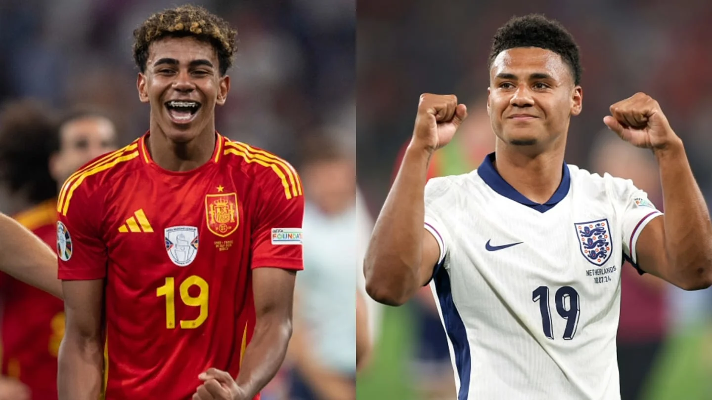

The stage is set for an epic clash at Berlin's Olympiastadion as Spain and England vie for the Euro 2024 trophy. This year's tournament has delivered thrilling matches and unforgettable moments, but now only one question remains: who will come out on top?

Before we continue, if you want to be among the first to hear about future updates, simply enter your email below, follow us on <a href="https://x.com/dataideaorg"><i class="bi bi-twitter-x"></i>
 (formally Twitter)</a>, or subscribe to our <a href="https://www.youtube.com/@dataideaorg"><i class="bi bi-youtube"></i> YouTube channel</a>.

<iframe src="https://embeds.beehiiv.com/5fc7c425-9c7e-4e08-a514-ad6c22beee74?slim=true" data-test-id="beehiiv-embed" height="52" frameborder="0" scrolling="no" style="margin: 0; border-radius: 0px !important; background-color: transparent; width: 100%;" ></iframe>

## Spain: La Roja's Dominance

Spain has been the standout team this summer, dazzling fans with their fluid, attacking style under Luis de la Fuente. Their journey to the final has been a masterclass in football. After breezing through the group stage with clean sheets against Croatia, Italy, and Albania, Spain showed resilience in the knockout rounds. They came from behind to beat Georgia 4-1 in the last 16 and triumphed over Germany and France in the quarter and semi-finals, respectively. Their perfect record and rock-solid defense make them favorites to lift the Henri Delaunay Trophy.

## England: The Three Lions' Resilience

For England, Euro 2024 has been a rollercoaster. Gareth Southgate's men entered the tournament as favorites but faced a mix of brilliance and frustration. The group stage saw them grind out a 1-0 win over Serbia and draw with Denmark and Slovenia. Critics questioned their ability to go all the way, but England proved their resilience in the knockout rounds. A dramatic comeback against Slovakia, a tense penalty shootout win over Switzerland, and a thrilling victory over the Netherlands showcased their fighting spirit.

## The Showdown: Tactics and Key Players

Spain's possession-based approach, led by Pedri and Alvaro Morata, will aim to control the game and break down England's defense. Their ability to keep clean sheets and dominate possession has been key to their success.

England will rely on a robust defense and quick transitions. The pace of Bukayo Saka and the creativity of Phil Foden will be crucial, while Harry Kane's goal-scoring prowess will be pivotal in their quest for glory.

Opta predicts Spain has a 60.38% chance of winning, making them the favorites. However, England's 39.62% chance reflects their ability to defy the odds.

## Final Thoughts

As the world tunes in for this epic clash, one thing is certain: we are in for a footballing spectacle. Will Spain's tiki-taka triumph, or will England's resilience shine through? The answer will be revealed on Sunday night in Berlin. Regardless of the outcome, Euro 2024 has given us unforgettable moments and a final that promises high drama and breathtaking football. Let the best team win!

## What do you think? Put it in the comments below!

