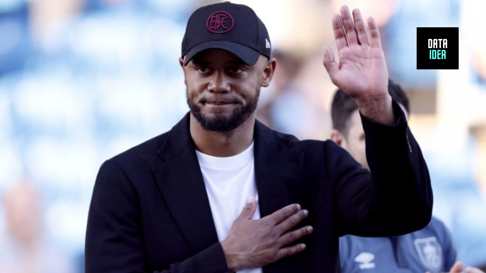

Bayern Munich have appointed Vincent Kompany as their new head coach after agreeing a compensation package of about £10m with Burnley.

Kompany has signed a three-year contract with Bayern, who made a surprise move for him having failed to persuade Thomas Tuchel to remain at the end of the season. Xabi Alonso, their former coach Julian Nagelsmann, and Austria’s coach Ralf Rangnick had turned down the post.

<ins class="adsbygoogle"
     style="display:block; text-align:center;"
     data-ad-layout="in-article"
     data-ad-format="fluid"
     data-ad-client="ca-pub-8076040302380238"
     data-ad-slot="8693891310"></ins>

Kompany has experience of the Bundesliga from his playing days at Hamburg and is fluent in German, although his appointment represents a bold move after Burnley’s relegation from the Premier League. Kompany enjoyed an outstanding first season at Turf Moor, winning the Championship with 101 points, but oversaw a poor Premier League campaign that brought only five wins.

“It’s a great honour to be able to work for this club,” said Kompany. “FC Bayern is an institution in international football. As a coach, you have to stand for who you are as a person: I love having the ball, being creative and we also have to be aggressive on the pitch and courageous. I’m now looking forward to the most basic things: working with the players, building a team. When the foundation is in place, success will follow.”

<ins class="adsbygoogle"
     style="display:block; text-align:center;"
     data-ad-layout="in-article"
     data-ad-format="fluid"
     data-ad-client="ca-pub-8076040302380238"
     data-ad-slot="8693891310"></ins>

Bayern’s sporting director, Christoph Freund, said: “Vincent Kompany is a type of coach who fits in very well with FC Bayern’s playing philosophy and identity: his teams want the ball, want to play dominant and high-intensity football. He is a young, very ambitious coach who brings a lot of international experience, has his finger on the pulse of the players and knows exactly what should happen on the pitch. He can and will give our team an enormous amount.”

Burnley’s search for a replacement to lead them back into the Premier League is under way. In a statement confirming Kompany’s departure, the club said: “Whilst we were initially confident in retaining our manager, the changing dynamics of the situation made this impossible. We understand the allure and prestige of a club like Bayern Munich and respect Vincent’s ambition to explore new opportunities. We have started the search for a new manager and will make an announcement in due course.”

<ins class="adsbygoogle"
     style="display:block; text-align:center;"
     data-ad-layout="in-article"
     data-ad-format="fluid"
     data-ad-client="ca-pub-8076040302380238"
     data-ad-slot="8693891310"></ins>

<iframe src="https://embeds.beehiiv.com/5fc7c425-9c7e-4e08-a514-ad6c22beee74?slim=true" data-test-id="beehiiv-embed" height="52" frameborder="0" scrolling="no" style="margin: 0; border-radius: 0px !important; background-color: transparent; width: 100%; font-family:futura;" ></iframe>

<h2>You may also like:</h2>
<a href="/posts/bayern_move_for_kompany/">
<h4>Why Bayern are after Kompany</h4>

</a>

