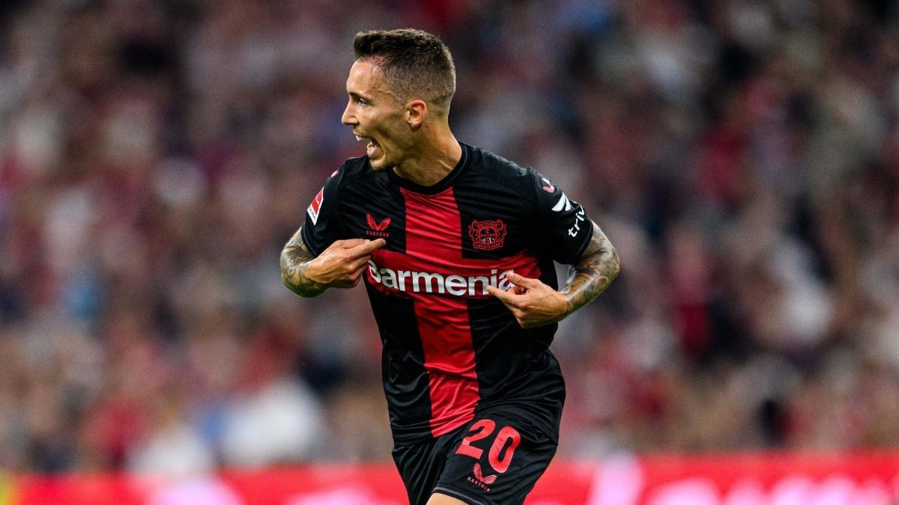

# Best European Signings of the 2023-24 Season

With the campaign almost over, DATAIDEA picks out the best bits of business done by the continent's top clubs last summer...

One can never be quite sure how transfers will turn out. Even the most talented players can struggle at top clubs because of variables like personality clashes with the coach, fitness problems, language barriers, and cultural differences. However, some deals go better than anyone could have expected. This season, we've seen expensive signings handle the pressure of a big transfer fee, while other, previously unknown players have proven themselves bargain buys.

But, looking at all the deals done last summer, who's proven the best value for money? Below, DATAIDEA ranks the 10 best signings of the season:

**10. Granit Xhaka - Bayer Leverkusen (£21.4m)**
Granit Xhaka left Arsenal to join an even more exciting young team managed by a better coach. At 31, Xhaka is playing the best football of his career, providing experience, tenacity, and technique to Xabi Alonso's sensational Bayer Leverkusen side, who are now two games away from a treble after winning their first-ever Bundesliga.

**9. Riccardo Calafiori - Bologna (£3.4m)**
Riccardo Calafiori exemplifies the miraculous work done at Bologna by coach Thiago Motta and technical director Giovanni Sartori. The 21-year-old, bought from Basel for a pittance, played a pivotal role in Bologna's qualification for the Champions League for the first time ever, transforming from a left-back into one of the classiest central defenders in Serie A.

<ins class="adsbygoogle"
     style="display:block; text-align:center;"
     data-ad-layout="in-article"
     data-ad-format="fluid"
     data-ad-client="ca-pub-8076040302380238"
     data-ad-slot="8693891310"></ins>

**8. Jude Bellingham - Real Madrid (£88m)**
Jude Bellingham's transfer from Borussia Dortmund to Real Madrid looked like a steal, and he's proven it. Bellingham has had one of the most impressive debut seasons from a Galactico, scoring 23 goals, including two stoppage-time Clasico winners. He could next week get his hands on the Champions League trophy.

**7. Marcus Thuram - Inter (free)**
Inter snapped up Marcus Thuram on a free transfer after his contract with Borussia Monchengladbach expired. With his pace, hold-up play, and selfless running, Thuram proved the ideal foil for Lautaro Martinez and contributed 15 goals himself. No wonder Inter fans have forgotten about Romelu Lukaku!

**6. Viktor Gyokeres - Sporting CP (£17m)**
Viktor Gyokeres went from playing Championship football to being linked with Europe's biggest clubs after a stellar season with Sporting CP. The Swede has an outrageous record of 43 goals in all competitions, helping Sporting win the title and aim for a domestic double.

<ins class="adsbygoogle"
     style="display:block; text-align:center;"
     data-ad-layout="in-article"
     data-ad-format="fluid"
     data-ad-client="ca-pub-8076040302380238"
     data-ad-slot="8693891310"></ins>

**5. Victor Boniface - Bayer Leverkusen (£17m)**
Victor Boniface missed two-and-a-half months of the season through injury but still scored 21 goals and made nine assists. His powerful and prolific play made him the leading man for Leverkusen, a perfect fit in their attack.

**4. Artem Dovbyk - Girona (£6.6m)**
Artem Dovbyk played a crucial role in Girona's shocking third-place finish in La Liga, securing Champions League qualification. The Ukraine international scored 21 goals, outshining even Robert Lewandowski.

**3. Alexander Sorloth - Villarreal (£8.5m)**
Alexander Sorloth blossomed at Villarreal, topping the La Liga scoring charts with 23 goals in 33 games. After struggling at Leipzig, Sorloth found his form in Spain, leading the Pichichi race.

<ins class="adsbygoogle"
     style="display:block; text-align:center;"
     data-ad-layout="in-article"
     data-ad-format="fluid"
     data-ad-client="ca-pub-8076040302380238"
     data-ad-slot="8693891310"></ins>

**2. Pierre-Emerick Aubameyang - Marseille (free)**
Pierre-Emerick Aubameyang revived his career at Marseille after a doomed spell at Chelsea. At almost 35, Aubameyang has been involved in more goals this season than many young stars, playing for the eighth-best team in Ligue 1.

**1. Alex Grimaldo - Bayer Leverkusen (free)**
Alex Grimaldo tops the list, contributing significantly to Leverkusen's historic campaign. Arriving from Benfica for nothing, Grimaldo formed a devastating wing-back pairing with Jeremie Frimpong, creating 17 goals and scoring 12 himself. His winning mentality and brilliant performances made him the signing of the season.

<ins class="adsbygoogle"
     style="display:block; text-align:center;"
     data-ad-layout="in-article"
     data-ad-format="fluid"
     data-ad-client="ca-pub-8076040302380238"
     data-ad-slot="8693891310"></ins>

