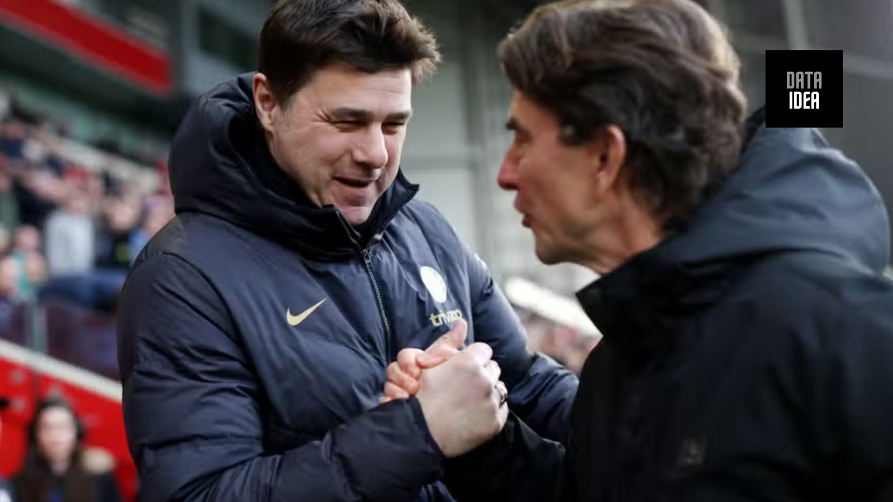

Chelsea manager Mauricio Pochettino, Brentford's Thomas Frank, and Manchester United manager Erik ten Hag

**How is Thomas Frank part of this conversation?**

We like Thomas Frank. We think he’s a good manager. But we see nothing to suggest he’s a Manchester United upgrade on Erik ten Hag or Mauricio Pochettino.

It says a lot about how this summer is going on the managerial merry-go-round that this piece, conceived at 9am in response to Thomas Frank being heavily backed in for the Chelsea job has, in the time spent writing it, morphed into a Thomas Frank-Manchester United tale instead.

Simply put, it is currently impossible to keep up with the absurd pace of developments around the manager hiring and firing game at the moment, and that’s especially true of Chelsea, a club that is violently unwell in a way we’ve never really seen before at the very top end of English football.

<ins class="adsbygoogle"
     style="display:block; text-align:center;"
     data-ad-layout="in-article"
     data-ad-format="fluid"
     data-ad-client="ca-pub-8076040302380238"
     data-ad-slot="8693891310"></ins>

While they now appear determined to appoint Enzo Maresca upon this very night, itself an extremely dubious upgrade on the departed Mauricio Pochettino, we’re left with 800 words to salvage. We could just bin it, but luckily this is the great Managergeddon of 2024. The bad news is that everything you write will be out of date before you finish it; the good news is that there will always be some way to repurpose it for another club beset by batsh\*ttery.

We like Frank a lot, is the first thing to say here. He’s a fine manager doing a fine job at a fine club. He just seems a decent sort of bloke happy to quietly get on with the job at hand. All of that is also kind of the problem. We just don’t know what anyone is seeing that suggests he’s any kind of fit for Chelsea or now Manchester United.

He’s only 18 months younger than Pochettino and four years younger than Erik ten Hag. He’s from the same generation, just without anything like the top-level CV those guys enjoy. It’s fair to point out that it’s hard to use the absence of big-club experience against a manager getting a big-club job, because how else is one supposed to get that experience? But at the same time there is such overwhelming evidence that making a leap of this size just so rarely works.

<ins class="adsbygoogle"
     style="display:block; text-align:center;"
     data-ad-layout="in-article"
     data-ad-format="fluid"
     data-ad-client="ca-pub-8076040302380238"
     data-ad-slot="8693891310"></ins>

There nearly always has to be a stepping stone between the small, well-run club and the gigantic superclub. The direct leap from small fry to big fish just almost never works.

We can’t be too effusive in our praise of Chelsea for looking beyond Frank given where they’ve landed instead. Maresca is at least a legitimately young coach at 44, but his entire first-team managerial career consists of 67 games with Parma (a reign that lasted only 14 matches) and Leicester, precisely none of which have been in the top flight. It’s an even bigger punt, if anything.

Frank can at least point to a pretty solid Premier League record, even if he does join Roberto De Zerbi as a highly-rated Premier League manager who timed a disappointing season particularly poorly leading into this summer of carnage.

<ins class="adsbygoogle"
     style="display:block; text-align:center;"
     data-ad-layout="in-article"
     data-ad-format="fluid"
     data-ad-client="ca-pub-8076040302380238"
     data-ad-slot="8693891310"></ins>

But can he point to anything that really resembles the challenge posed by your Manchester Uniteds or the Chelseas of this world? Anything at all that suggests he’s a legitimate upgrade on the inconvenient-trophy-snaffling Ten Hag rather than just a very good football manager quietly getting on with things at a lower level with vastly less attention and pressure?

We just don’t see it. If anything, the opposite is true. The one time Brentford have faced significant outside attention involving a big name was the Great and Trumpeted Return of Ivan Toney. And that went almost completely to sh\*t after about five games.

The unique awkwardness of that particular situation was not remotely of Frank’s making, but nothing about his handling of it suggested a man about to go in and sort out the egos of a group of players who wouldn’t take Ralf Rangnick seriously.

<ins class="adsbygoogle"
     style="display:block; text-align:center;"
     data-ad-layout="in-article"
     data-ad-format="fluid"
     data-ad-client="ca-pub-8076040302380238"
     data-ad-slot="8693891310"></ins>

Frank may very well have the requisite charisma and energy for big-club management, but whether he – or anyone, really – could make the leap direct from a ‘bus stop in Hounslow’ to ‘This is Manchester United Football Club we’re talking about’ just seems so thoroughly doubtful. We’re certainly not clear why any set of big-club fans should particularly want to provide the proving ground, in any case.

Chelsea have decided to sack Pochettino, which is mad. United will probably still sack Ten Hag, which is less mad. That both appear to be casting their nets around some very untried managers is enormously perplexing.

<ins class="adsbygoogle"
     style="display:block; text-align:center;"
     data-ad-layout="in-article"
     data-ad-format="fluid"
     data-ad-client="ca-pub-8076040302380238"
     data-ad-slot="8693891310"></ins>

<h2>You may like:</h2>
<a href="/posts/united_to_sack_ten_hag/">
<h4>United to Sack Ten H</h4>

</a>

